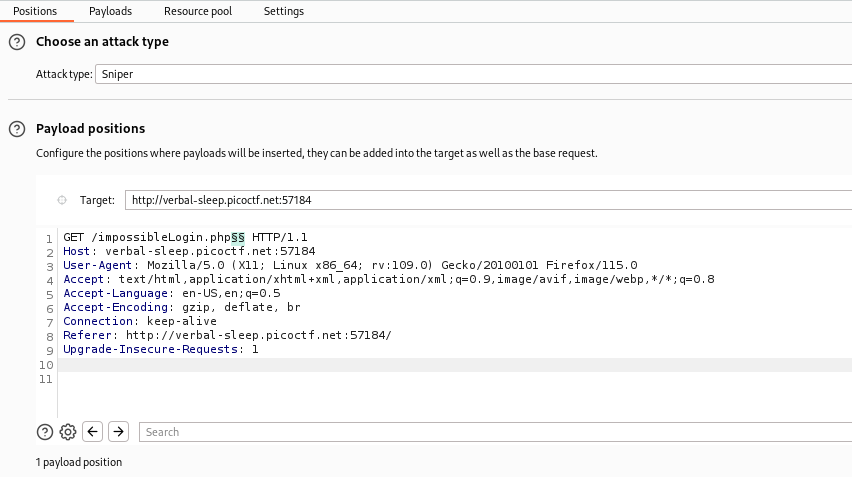

# Overview 
Category: [Web Exploitation]()

AUTHOR: Junias Bonou

# Description
I found a web app that claims to be impossible to hack!

# Solution
- Trang web với chức năng login đơn giản


- Dựa vào hint : backup file thì tôi đã scan directory nhưng không có gì 

- Trước tôi đã đọc bài viết về lỗi liên quan đến phân tách đường dẫn (path delimiter issues) — một kỹ thuật thường dùng trong Web Cache Deception hoặc Access Control Bypass.
[link!](https://x.com/WebSecAcademy/status/1919142786885943404)

- Một số ký tự đặc biệt như ;, ?, #, =, @... khi thêm vào URL có thể khiến:

+ Server xử lý khác nhau.

+ Cache (bộ nhớ đệm) lưu nhầm nội dung riêng tư.

+ Kiểm tra quyền truy cập bị bỏ qua.

- Tôi sẽ dùng tab intruder để gửi xem có thể bypass login hay xem được thông tin gì không 



- Kết quả có ký tự trong list trả về 200 đó là : "~"


- Quan sát response ta thấy đoạn code php
```php
<?php
 if(isset($_POST[base64_decode("\144\130\x4e\154\x63\155\x35\x68\142\127\125\x3d")])&& isset($_POST[base64_decode("\143\x48\x64\x6b")])){$yuf85e0677=$_POST[base64_decode("\144\x58\x4e\154\x63\x6d\65\150\x62\127\x55\75")];$rs35c246d5=$_POST[base64_decode("\143\x48\144\153")];if($yuf85e0677==$rs35c246d5){echo base64_decode("\x50\x47\112\x79\x4c\172\x35\x47\x59\127\154\163\132\127\x51\x68\111\x45\x35\166\x49\x47\132\163\131\127\x63\x67\x5a\155\71\171\111\x48\x6c\166\x64\x51\x3d\x3d");}else{if(sha1($yuf85e0677)===sha1($rs35c246d5)){echo file_get_contents(base64_decode("\x4c\151\64\166\x5a\x6d\x78\x68\x5a\x79\65\60\145\110\x51\75"));}else{echo base64_decode("\x50\107\112\171\x4c\x7a\65\107\x59\x57\154\x73\x5a\127\x51\x68\x49\105\x35\x76\111\x47\132\x73\131\127\x63\x67\x5a\155\71\x79\x49\110\154\x76\x64\x51\x3d\75");}}}?>
 ```

- Đoạn code đã được encode bây giờ ta sẽ decode
```php
<?php
if(isset($_POST[“username”]) && isset($_POST[“password”])) {
$yuf85e0677 = $_POST[“username”];
$rs35c246d5 = $_POST[“password”];

if($yuf85e0677 == $rs35c246d5) {
echo “<br/>Failed! No flag for you”;
} else {
    if(sha1($yuf85e0677) === sha1($rs35c246d5)) {
        echo file_get_contents(“../flag.txt”);
    } else {
        echo “<br/>Failed! No flag for you”;
    }
    }
}
?>
```
- Có nghĩa là username với password khác nhau nhưng có cùng SHA1 hash thì sẽ lấy được flag 

- Sau khi đọc tài liệu tôi phát hiện : gọi hàm sha1 bằng một mảng trong PHP sẽ trả về null . Vì vậy tôi sẽ cho username và password trả về mảng thay vì string khi đó sha1 hash sẽ đều là null và lấy được flag 


- Thực hiện lấy flag : 


>Flag : **picoCTF{w3Ll_d3sErV3d_Ch4mp_9c79e5f6}**

