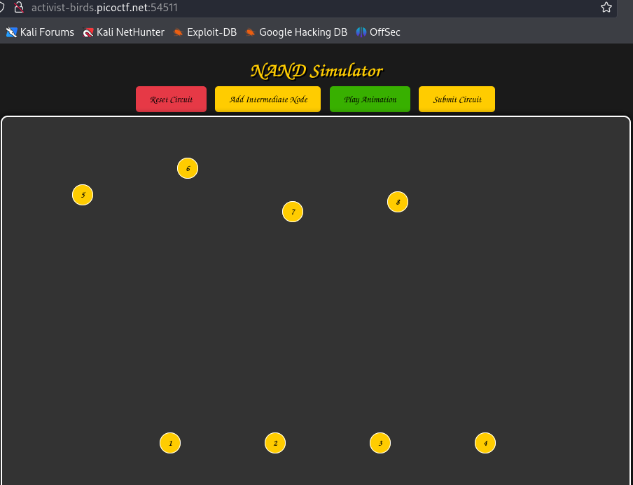
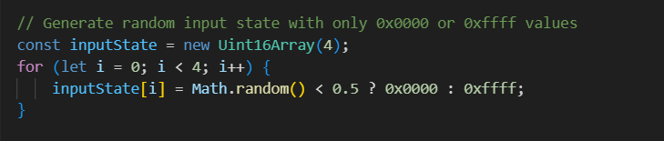
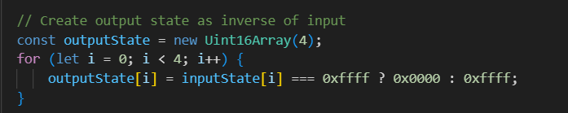
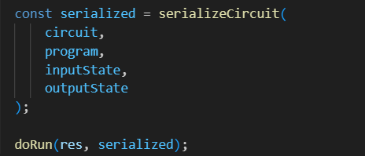
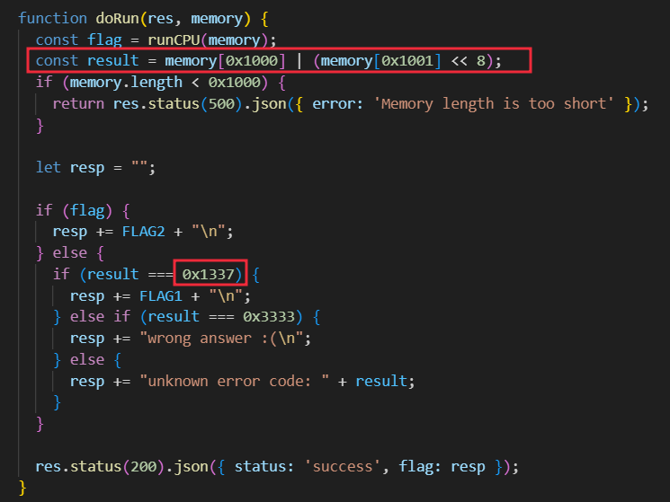
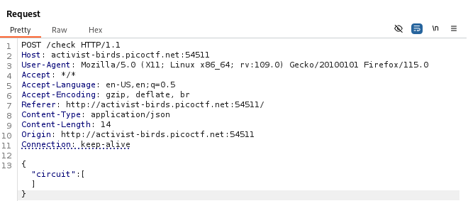
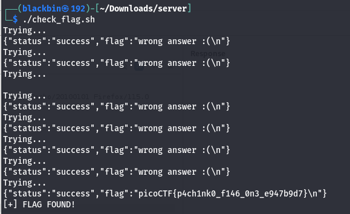

# Overview 
Category: [Web Exploitation]()

AUTHOR: notdeghost

# Description
History has failed us, but no matter.
Server source
There are two flags in this challenge. Submit flag one here, and flag two in Pachinko Revisited.
Additional details will be available after launching your challenge instance.

# Solution
- Trang web liên quan đến bộ nhớ của máy ảo 


- Khi đọc source code ta phát hiện 
- Hàm /check trong server:

>Tạo 4 số 16-bit ngẫu nhiên (chỉ có 0x0000 hoặc 0xFFFF):



>Tạo outputState là nghịch đảo của inputState:



>Serialize cả inputState, outputState, và circuit (mảng rỗng) vào memory.



- Chạy chương trình ảo hóa (runCPU), chương trình này:

>Đọc từ memory

>Chạy logic CPU mô phỏng

>Sau khi chạy xong, kiểm tra 2 byte ở memory[0x1000] và memory[0x1001]:



- Nếu memory[0x1000] = 0x1337 & memory[0x1001] << 8-> Thì nhận được flag!

- Khi thưc hiện gửi gói post /check thì nó sẽ random bit và ta không thể chỉnh được nên hầu như không nhận được flag  


- Giải pháp sẽ cứ gửi requets liên tục cho khi nào cpu random đúng bit thì ta sẽ nhận được flag 
- Payload :
```bash
#!/bin/bash

while true; do
  echo "Trying..."
  resp=$(curl -s -X POST http://activist-birds.picoctf.net:54511/check \
    -H "Content-Type: application/json" \
    -d '{"circuit":[]}')
  
  echo "$resp"

  if echo "$resp" | grep -q "picoCTF{"; then
    echo "[+] FLAG FOUND!"
    break
  fi
done
```

- Sau nhiều làn gửi requests thì nhận được flag :


>Flag : **picoCTF{p4ch1nk0_f146_0n3_e947b9d7}**