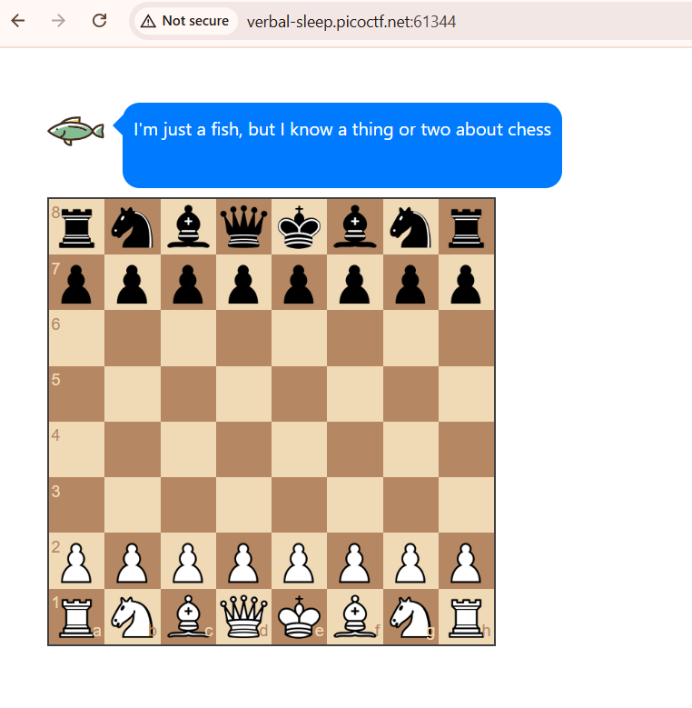
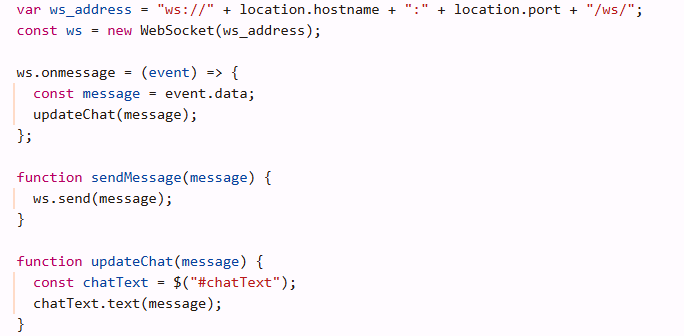
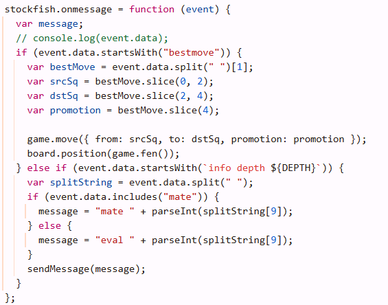
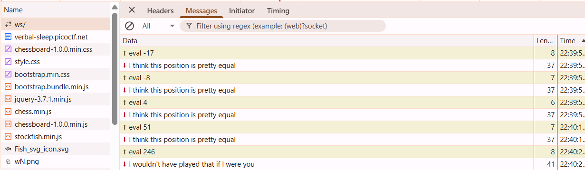
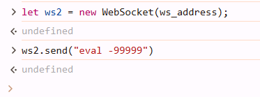
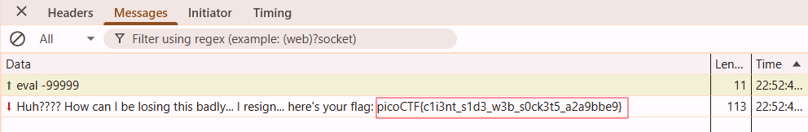
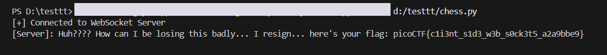

# Overview 
Category: [Web Exploitation]()

AUTHOR: Venax

# Description
Can you win in a convincing manner against this chess bot? He won't go easy on you! 

# Solution
- Đây là một ứng dụng chơi cờ vua trong trình duyệt, sử dụng Stockfish (một engine cờ vua mạnh) và WebSocket để giao tiếp thời gian thực với một server



- Đoạn code sử dụng websocket để gửi , update thông báo :



- Các gói tin WebSocket có 2 loại định dạng:

"eval [số]" → đánh giá vị trí hiện tại.

"mate [số]" → thông báo chiếu hết.



- Bắt gói tin ws ta thấy , thông báo sẽ được hiển thị sau mỗi nước đi dựa vào eval 



- Ta thấy rằng nó bắt đầu bằng Eval 0 khi chúng ta thực hiện bước đầu tiên và khi chúng ta bắt đầu mất tướng, có lẽ con số càng lớn, điều đó có nghĩa là sự tự tin càng cao mà Stockfish nghĩ rằng nó đang chiến thắng

- Ý tưởng sẽ là làm cho eval này trở thành số âm lớn để Stockfish nghĩ rằng nó đang thua đậm và đầu hàng 

- Thực hiện chỉnh ws trong console: 



- Và bot đã nghĩ mình thua và đã trả flag:

 

>Flag : **picoCTF{c1i3nt_s1d3_w3b_s0ck3t5_a2a9bbe9}**

- Bonus : có thể viết script để tự động 
```python 
import websocket

ws_url = "ws://verbal-sleep.picoctf.net:61344/ws/"

def on_open(ws):
    print("[+] Connected to WebSocket Server")
    ws.send("eval -99999999")
    
# Hàm callback khi nhận được tin nhắn từ WebSocket
def on_message(ws, message):
    print(f"[Server]: {message}")

def on_error(ws, error):
    print(f"Error: {error}")

def on_close(ws, close_status_code, close_msg):
    print("[+] Connection Closed")

ws = websocket.WebSocketApp(ws_url,
                            on_open=on_open,
                            on_message=on_message,
                            on_error=on_error,
                            on_close=on_close)

ws.run_forever()
```

 