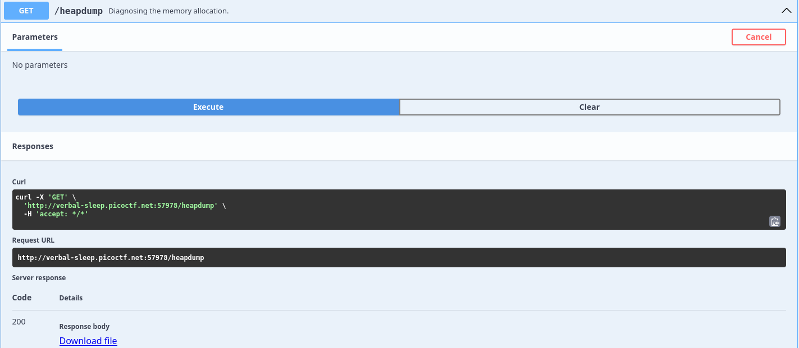
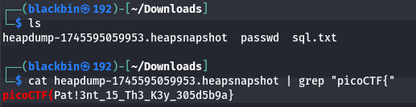

# Overview 
Category: [Web Exploitation]()

AUTHOR: Prince Niyonshuti N

# Description
Welcome to the challenge! In this challenge, you will explore a web application and find an endpoint that exposes a file containing a hidden flag.
The application is a simple blog website where you can read articles about various topics, including an article about API Documentation. Your goal is to explore the application and find the endpoint that generates files holding the server’s memory, where a secret flag is hidden.
Additional details will be available after launching your challenge instance.

# Solution
- Trang web là trang blog


- Thấy api get /headump và thử execute sau đó thu được file headsnapshotheadsnapshot



-  File heap snapshot (thường có đuôi .heapsnapshot) là file chứa bản ghi chi tiết về bộ nhớ heap (vùng nhớ cấp phát động) của ứng dụng Node.js tại thời điểm chụp snapshot.

- Nó thường được dùng để:
```
Phân tích memory leak (rò rỉ bộ nhớ)

Kiểm tra lượng object đang tồn tại trong bộ nhớ

Tối ưu hóa việc sử dụng RAM

Debug các vấn đề hiệu suất liên quan đến bộ nhớ
```

- Down file headsnapshot về và tìm flag trong file ấy 



>Flag : **picoCTF{Pat!3nt_15_Th3_K3y_305d5b9a}**