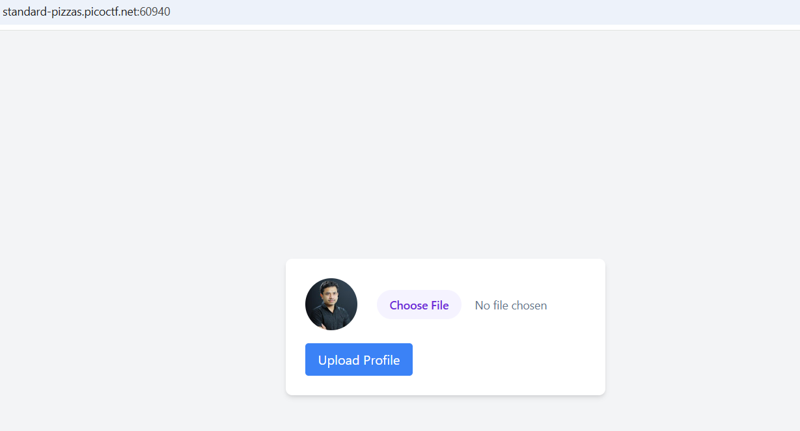
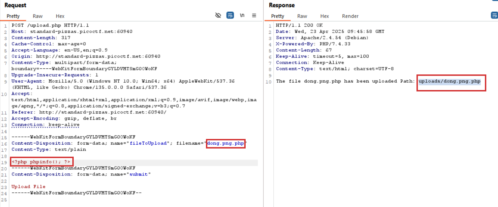
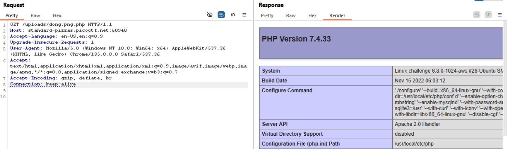
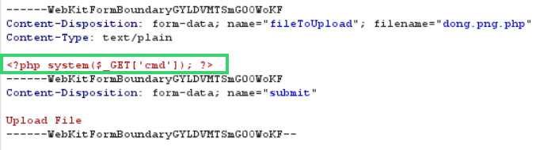
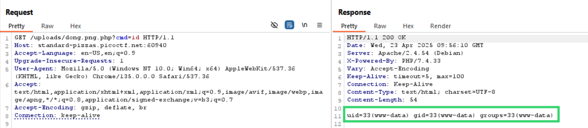
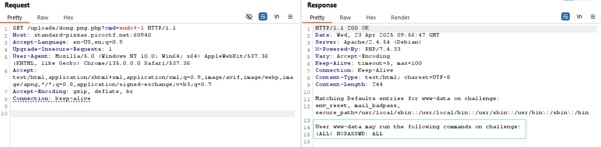
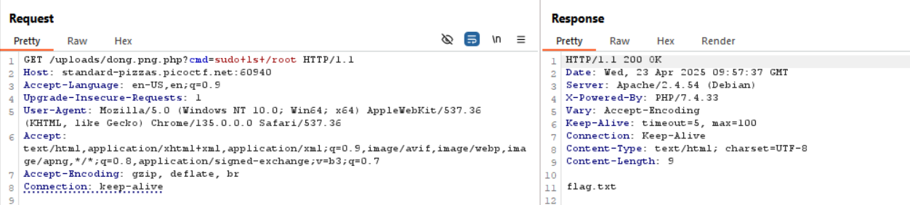
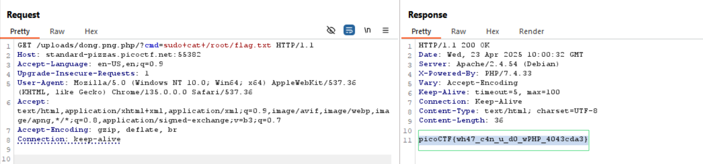

# Overview 
Category: [Web Exploitation]()

AUTHOR: Prince Niyonshuti N

# Description
A developer has added profile picture upload functionality to a website. However, the implementation is flawed, and it presents an opportunity for you. Your mission, should you choose to accept it, is to navigate to the provided web page and locate the file upload area. Your ultimate goal is to find the hidden flag located in the /root directory.
Additional details will be available after launching your challenge instance.

# Solution
- Trang web có chức năng upload filefile



- Sau khi upload lên file .txt thì thành công và biết được web đang dùng php 

- Do web chặn upload file .php  nên ta sẽ bypass bằng cách .png.php (do dev chỉ config xác định loại file bằng cách lấy extension sau dấu "." đầu tiên)
```php
explode('.', $_FILES['file']['name'])[1];
```



- Kết quả trả về version PHP 



- Thay đổi payload để dễ rce 



- Xem người dùng hiện tại và xem có quyền sudo không 





=> Hiện tại đang là : www-data và có quyền chạy sudo mà không cần pass

- Thực hiện đọc file trong thưc mục /root và lấy flag :




>Flag : **picoCTF{wh47_c4n_u_d0_wPHP_4043cda3}**